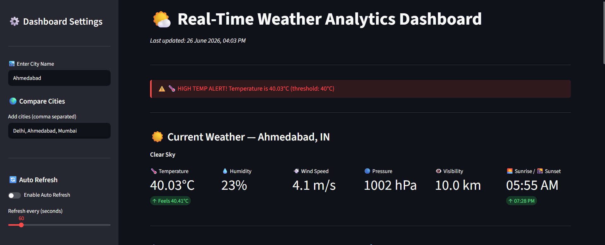
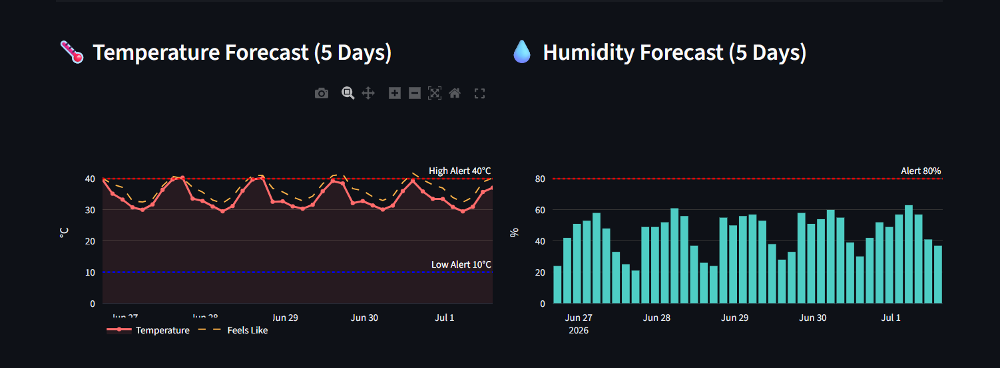
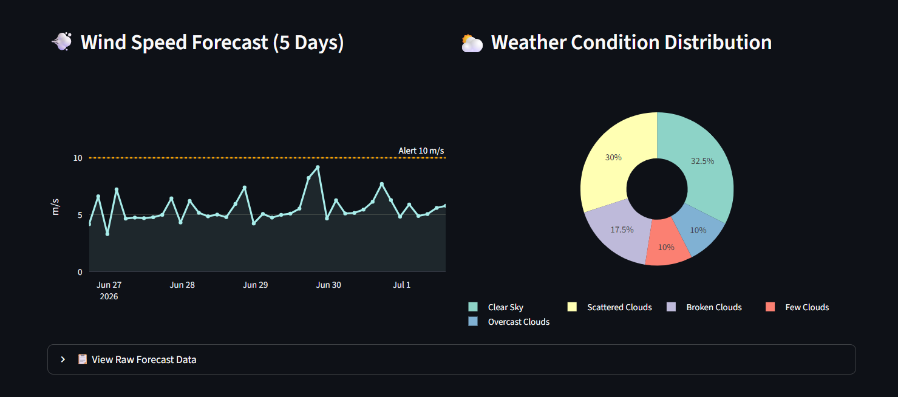
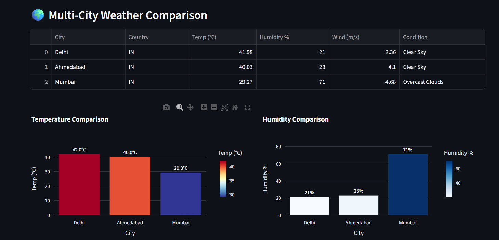
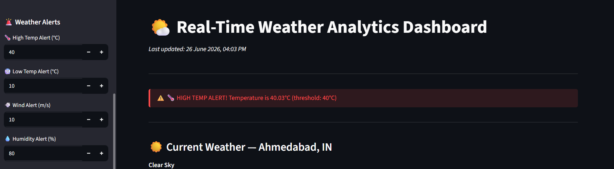

# 🌤️ Real-Time Weather Analytics Dashboard

A modern **Real-Time Weather Analytics Dashboard** built with **Python**, **Streamlit**, **OpenWeatherMap API**, and **Plotly**. The application fetches live weather data, processes it in real time, and displays interactive analytics through an intuitive dashboard.

This project demonstrates API integration, data processing, interactive visualization, and dashboard development using Python.

---

## 📌 Project Overview

The Real-Time Weather Analytics Dashboard provides users with up-to-date weather information for any city using the OpenWeatherMap API. The dashboard presents current weather conditions, a 5-day forecast, interactive charts, weather alerts, and multi-city comparison in an easy-to-use interface.

This project simulates a real-world analytics dashboard that continuously processes live data and presents meaningful insights.

---

## ✨ Key Features

* 🌤️ Live weather data retrieval using OpenWeatherMap API
* 🌡️ Current temperature and "Feels Like" temperature
* 💧 Humidity monitoring
* 💨 Wind speed analysis
* 🔵 Atmospheric pressure information
* 👁️ Visibility tracking
* 🌅 Sunrise and Sunset timings
* 📅 5-Day Weather Forecast
* 📊 Interactive Plotly charts
* 🚨 Weather alert system
* 🌍 Multi-city weather comparison
* 🔄 Auto-refresh functionality
* 📋 Raw forecast data table
* 🔐 Secure API key management using `.env`

---

## 🛠️ Technologies Used

| Technology         | Purpose                           |
| ------------------ | --------------------------------- |
| Python             | Core Programming Language         |
| Streamlit          | Interactive Dashboard Development |
| OpenWeatherMap API | Live Weather Data                 |
| Requests           | API Communication                 |
| Pandas             | Data Processing                   |
| Plotly             | Interactive Data Visualization    |
| python-dotenv      | Secure API Key Management         |

---

## 📂 Project Structure

```text
real-time-weather-analytics-dashboard/
│
├── weather_dashboard.py
├── requirements.txt
├── README.md
├── LICENSE
├── .gitignore
├── screenshots/
│   ├── dashboard.png
│   ├── alerts.png
│   ├── comparison.png
│   ├── forecast_1.png
│   └── forecast_2.png
└── .env (Local file – Not uploaded to GitHub)
```

---

## 🚀 Installation Guide

### 1️⃣ Clone the Repository

```bash
git clone https://github.com/YugHk007/real-time-weather-analytics-dashboard.git
```

### 2️⃣ Navigate to the Project Folder

```bash
cd real-time-weather-analytics-dashboard
```

### 3️⃣ Install Required Libraries

```bash
pip install -r requirements.txt
```

### 4️⃣ Create a `.env` File

```text
OPENWEATHER_API_KEY=YOUR_API_KEY
```

Replace `YOUR_API_KEY` with your OpenWeatherMap API key.

### 5️⃣ Run the Application

```bash
streamlit run weather_dashboard.py
```

---

# 📷 Dashboard Screenshots

## 🏠 Main Dashboard

Displays current weather information along with important weather metrics.



---

## 📈 5-Day Weather Forecast

Interactive weather forecast for upcoming days.





---

## 🌍 Multi-City Weather Comparison

Compare weather conditions across multiple cities.



---

## 🚨 Weather Alerts

Automatically displays alerts when weather parameters exceed predefined thresholds.



---

## 📊 Dashboard Functionalities

The dashboard provides:

* Current Weather Monitoring
* Temperature Analytics
* Humidity Analytics
* Wind Speed Monitoring
* Atmospheric Pressure
* Visibility Tracking
* Sunrise & Sunset Information
* Weather Forecast Charts
* Multi-City Comparison
* Weather Alerts
* Interactive Visualizations
* Raw Forecast Data

---

## 💡 Skills Demonstrated

* REST API Integration
* Real-Time Data Processing
* Dashboard Development
* Data Visualization
* Python Programming
* Streamlit Development
* Environment Variable Management
* Interactive Analytics
* Data Cleaning & Processing

---

## 🔮 Future Improvements

* 📍 GPS-based Location Detection
* 📧 Email Weather Alerts
* 📱 SMS Notifications
* 📈 Historical Weather Analysis
* ☁️ Cloud Deployment
* 🗄️ Database Integration
* 🤖 AI-Based Weather Prediction
* 🌙 Dark/Light Theme Toggle

---

## 👨‍💻 Author

**Yug H K**

GitHub: https://github.com/YugHk007

---

## 📄 License

This project is licensed under the **MIT License**.

---

## ⭐ Support

If you found this project helpful, please consider giving it a ⭐ on GitHub.
